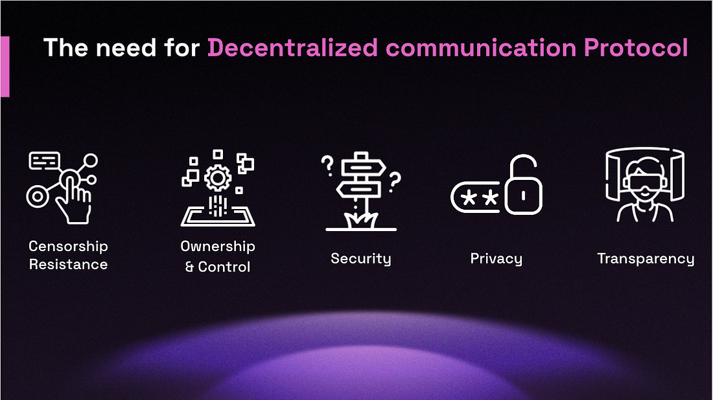
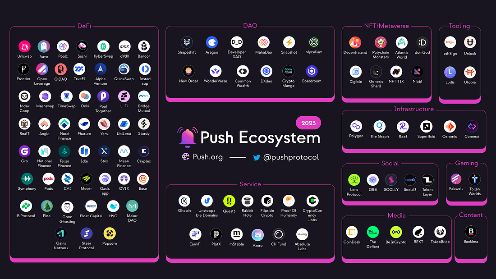

---

slug: web3-and-push-protocol-through-the-lens-of-first-principle-thinking
title: Web3 & Push Protocol through the Lens of First Principle Thinking🔍
authors: [push]
tags: [ Pn101, First Principles Thinking, Web3, Blockchain Technology]

---

<!--truncate-->

First-principle thinking means breaking down a complex problem into its most basic, foundational elements.

One example of applying First-principle thinking is Richard Feynman’s (an American theoretical physicist) famous essay that starts with basic algebra such as addition and subtraction and explains calculus in just [four pages](https://www.feynmanlectures.caltech.edu/I_22.html) through fully connected coherent reasoning.

With that, let’s explore the Push Protocol by applying First Principle Thinking:

## The Internet.
The internet is a global network of computers and devices connected by a set of standardized communication protocols. These protocols define how information is transmitted across the network, including how data is encoded, transmitted, and received.

These devices are connected together through a variety of wired and wireless connections, including fiber optic cables, copper wires, and radio waves.

The internet is based on a set of standard protocols, including TCP/IP (Transmission Control Protocol/Internet Protocol), which define how data is transmitted across the network. This creates a foundation for how data is broken down into packets, how those packets are addressed and routed across the network, and how they are reassembled into a complete message at the destination.

These protocols allow computers and devices to communicate with each other regardless of their location or type. They also provide a foundation for a wide range of applications and services, including email, web browsing, social networking, and online commerce.

## How the Internet got Centralized.
The internet started out as a decentralized network, with no central authority in control. However, over time, the internet has become increasingly centralized as companies and organizations have gained more power and control over critical aspects of the network.

One of the main reasons for this centralization is the growth of large internet service providers (ISPs) and content providers. These companies have become dominant players in the online ecosystem, controlling vast amounts of data and traffic, and using their power to influence how the internet is used and accessed.

Another factor contributing to centralization is the development of proprietary technologies and platforms that are controlled by a few large companies. For example, many people use Google’s search engine, Facebook’s social media platform, and Amazon’s Web Service, which all operate on proprietary technology that is controlled by those companies.

In addition, there are certain technical limitations of the internet itself that can contribute to centralization. For example, the Domain Name System (DNS), which is used to translate domain names into IP addresses, is controlled by a small number of organizations, making it a point of centralization.

## The Blockchain.
A blockchain is a distributed, decentralized ledger that is used to record transactions or information in a secure and transparent manner.

At its core, a blockchain consists of a network of computers that work together to validate and record each transaction. Each transaction is added to a basic containers of information in a blockchain which are known as block, which is then added to the existing chain of blocks, creating an immutable and transparent ledger that is visible to all participants in the network.

The security of a blockchain is achieved through the use of cryptographic algorithms and consensus mechanisms. Each transaction is encrypted and validated by multiple participants in the network, using a consensus mechanism such as proof of work or proof of stake. Once validated, the transaction is added to the blockchain and cannot be altered or deleted.

## The Need for Decentralized Communication Protocols

Decentralized communication protocols on the blockchain offer several benefits that traditional centralized communication systems cannot provide. Here are some of the reasons why a decentralized communication protocol on the blockchain is needed:

- <b>Security:</b> Decentralized communication protocols on the blockchain are more secure as they use cryptography and peer-to-peer networking to ensure that messages are transmitted securely and cannot be intercepted or tampered with by third parties. In contrast, centralized communication systems are vulnerable to hacking, data breaches, and other security threats.
- <b>Privacy:</b> Decentralized communication protocols on blockchain offer greater privacy as they do not require users to provide personal information to a centralized authority. This helps to protect users’ privacy.
- <b>Censorship resistance:</b> Decentralized communication protocols on blockchain are resistant to censorship as there is no centralized authority that can control or censor the flow of information. This helps to ensure that people can communicate freely without fear of censorship or repression.
- <b>Ownership and control:</b> Decentralized communication protocols on blockchain give users ownership and control over their data and communications. In contrast, centralized communication systems often collect and use user data for commercial or other purposes without their consent.

Overall, a decentralized communication protocol on blockchain is needed to provide greater security, privacy, censorship resistance, ownership, control, and transparency than traditional centralized communication systems. By leveraging the power of blockchain technology, decentralized communication protocols can help to create a more open, secure, and democratic internet for everyone.

## The Push Protocol
Push protocol is a decentralized communication protocol. Push protocol enables cross-chain notifications and messaging for dapps, wallets, and services through an open, gasless, and platform-agnostic mechanism.

This means that different applications and services can communicate with each other in a secure and open way, regardless of the blockchain platform they are built on.

The Push protocol provides an open communication layer that allows any crypto wallet/frontend to tap into the network and get the communication across. This can help to improve the interoperability and usability of decentralized applications and services in the blockchain ecosystem.

Push has empowered the web3 space by delivering 25 million+ notifications, 70k+ subscribers, and over 150 integrations so far.

The Push Ecosystem

## About Push Protocol

Push is the communication protocol of web3. Push protocol enables cross-chain notifications and messaging for dapps, wallets, and services tied to wallet addresses in an open, gasless, and platform-agnostic fashion. The open communication layer allows any crypto wallet /frontend to tap into the network and get the communication across.

To keep up-to-date with Push Protocol: [Website](https://push.org/), [Twitter](https://twitter.com/pushprotocol), [Telegram](https://t.me/epnsproject), [Discord](https://discord.gg/pushprotocol), [YouTube](https://www.youtube.com/c/EthereumPushNotificationService), and [Linktree](https://linktr.ee/pushprotocol).