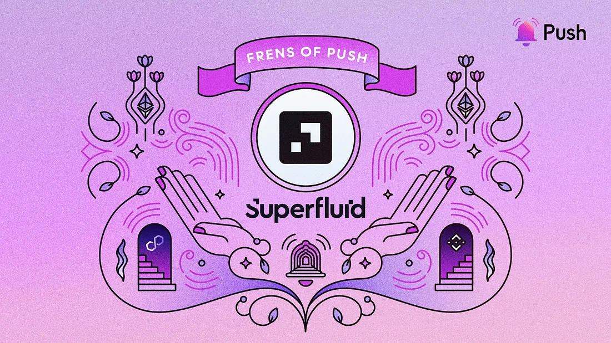

---

slug: superfluid-enhancing-web3-asset-streaming-with-push
title: Superfluid Enhancing Web3 Asset-Streaming With Push💜💚
authors: [push]
tags: [ Frensofpush, Web3, Push Protocol, Superfluid Protocol]

---

<!--truncate-->

This week, we’re thrilled to feature our #FrensOfPush, Superfluid!🎉

The leading asset-streaming protocol revolutionizing the way web3-native organizations handle payments and subscriptions.

Superfluid is a decentralized payment protocol that enables DAOs and crypto-native organizations to stream assets in a non-custodial and permissionless manner. This is particularly useful for projects that demand frequent and recurring transactions. By enabling real-time payments, Superfluid allows for fast and frictionless value transfer without gas fees. The protocol’s commitment to trustlessness and decentralization makes it a popular choice among organizations that value security and transparency in their payment processing.

While the demand for asset streaming grows in web3, communicating with users through their wallet addresses has been challenging. That’s where Push comes in! With Push’s communication tools, Superfluid is able to notify users about their streams, helping them manage their token balances, keeping their subscriptions, DCAs, and payments flowing.

In this episode of ‘Frens of Push’, we are in conversation with [Vijay Michalik](https://twitter.com/vijaymichalik) to talk about Superfluid’s solutions, its vision, and journey with Push.

<b>.   .   .</b>

## 1. Hi there, how did you become involved in building in the blockchain space? What’s your story?

<i>Vijay Michalik, Product Lead, Superfluid</i>

I started exploring crypto as an analyst in 2014 and 2015, and met a bunch of the great people working on early Ethereum between Devcon1 in London and several different events in Summer 2016.

When ConsenSys launched a London office in summer 2017 I signed up, working across business analyst, business development and community roles until moving into the Protocol Engineering team in 2018, eventually becoming a Product Manager for Hyperledger Besu & Quorum.

I signed up for Superfluid in 2021 as the first Product hire to help build the second iteration of Superfluid’s user and developer product lineup and help capture the great opportunities ahead of us for the Superfluid Protocol. Since then I’ve been building the team and our lean iteration muscles exploring a bunch of new features and products.

## 2. Tell us about Superfluid — what’s it about, and what problem does Superfluid solve?

Superfluid is the leading asset streaming protocol that enables Web3 native recurring payments like subscriptions, salaries and rewards for DAOs and crypto-native businesses. It can be used to describe cash flows and execute them automatically over time fully on-chain.

[Superfluid streams](https://medium.com/superfluid-blog/superfluid-streams-5cc5141dd8a7) transfer value in a constant flow over time between wallets, in a non-custodial and permissionless way. Streams are programmable, composable, and modular, allowing developers to build custom applications on top of the protocol.

The protocol has been <b>designed as a toolbox</b> for web3 businesses and developers to build custom applications with their own logic. If you’d like to integrate Superfluid in your project our [technical documentation](https://docs.superfluid.finance/) is a good starting point. For any technical support reach out to our team and community via our [Discord](http://discord.superfluid.finance/).

Over 600 projects have been built with Superfluid so far. Check out some of the live and upcoming projects [here](https://app.superfluid.finance/ecosystem).

## 3. What’s your 2023 plan for Superfluid?

In 2023 we are continuing to double down on the one thing that really matters: helping builders create incredible new products & services using the Superfluid protocol as simply as possible.

We’re adding a major new capability to the protocol — check our Github for alpha!

We’ll also be expanding our reach into new domains and networks to help builders in DeFi, GameFi and web3 social.

## 4. How is Superfluid using Push’s web3 communication layer?

Superfluid uses Push for user notifications about streams, particularly helping users manage their token balances and keeping their subscriptions, DCAs and payments flowing.

## 5. How would you describe your experience using Push? What benefits have you seen?

Push gives us a means to direct messages straight to users in a privacy-preserving way. People can sign up using their wallet alone!

We’re excited to add new notification types and more granularity in the future.

## 6. What cool use cases do you see Push being used for in the future?

I look forward to seeing more interoperability in web3 social and having apps support Lens, Push and other messaging types side-by-side.

## 7. What haven’t we asked you about that you wish we had?

We encourage all builders interested in Superfluid to check out our [Wave Pool](https://docs.superfluid.finance/superfluid/resources/superfluid-wave-pool) continuous hackathon — earn prizes every month for building on Superfluid!

<b>.   .   .</b>

## About Superfluid

Superfluid is the leading asset streaming protocol that enables Web3 native subscriptions, salaries, and rewards for DAOs and crypto-native businesses. Superfluid streams transfer value in a constant flow over time between wallets in a non-custodial and permissionless manner. Superfluid Protocol can be used to describe cash flows and execute them automatically on-chain, over time, and in a non-interactive way. Money streams are programmable, composable, and modular, allowing developers to build custom applications on top of the protocol. No capital is locked up, and all inflows and outflows are netted in real-time at every block without consuming any gas. Ongoing streams can be forwarded as they are received to both wallets and applications, eliminating delays and drastically increasing capital efficiency.

[Website](https://www.superfluid.finance/home) | [App](https://app.superfluid.finance/) | [Docs](http://docs.superfluid.finance/) | [Twitter](https://twitter.com/intent/follow?screen_name=Superfluid_HQ) | [Discord](http://discord.superfluid.finance/)

## About Push Protocol

Push is the communication protocol of web3. Push protocol enables cross-chain notifications and messaging for dapps, wallets, and services tied to wallet addresses in an open, gasless, and platform-agnostic fashion. The open communication layer allows any crypto wallet /frontend to tap into the network and get the communication across.

To keep up-to-date with Push Protocol: [Website](https://push.org/), [Twitter](https://twitter.com/pushprotocol), [Telegram](https://t.me/epnsproject), [Discord](https://discord.gg/pushprotocol), [YouTube](https://www.youtube.com/c/EthereumPushNotificationService), and [Linktree](https://linktr.ee/pushprotocol).