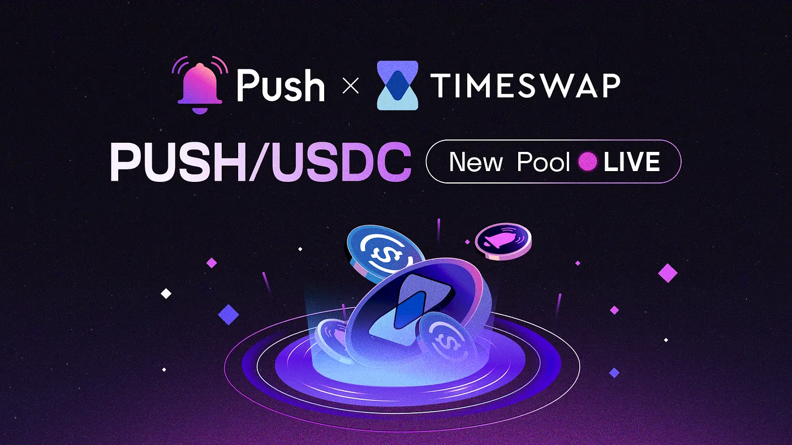

import { SubHeader } from '@site/src/components/SharedStylingV2';

<SubHeader> $PUSH lending/borrowing pool is now live on Timeswap.
</SubHeader>

Following the exciting launch of $PUSH onto Polygon, we’re thrilled to announce the launch of Push’s lending and borrowing pool on [TimeSwap](https://timeswap.io/). This partnership opens up new opportunities for users to borrow and lend Push native tokens ($PUSH) while benefiting from the extensive functionalities and composability offered by TimeSwap and the Polygon network.

Polygon, known for its high scalability and low transaction costs, provides the perfect environment to enhance the utility and functionalities of the $PUSH token. We couldn’t be more excited to start this journey!

## Push x Timeswap
Timeswap is the first fully decentralized AMM-based money market protocol that is non-custodial, immutable, censorship-resistant, and works without oracles or liquidators.

With the launch of the lending pool on TimeSwap, users can now borrow and lend $PUSH tokens on the Polygon mainnet, further enhancing the token’s utility and expanding its composability.

Through this partnership, Push gains access to Polygon’s ecosystem, offering users increased opportunities to explore various DeFi strategies, including:

- Borrowing $PUSH at a fixed interest rate
- Earn a fixed interest rate by lending $PUSH

### A quick rundown of the pool
The PUSH-USDC pool will enable fixed-rate lending/borrowing of $PUSH token using USDC as collateral, with an initial APR of 30%.

- <b>Pair:</b> PUSH/USDC
- <b>Asset to be lent/borrowed:</b> PUSH
- <b>Collateral:</b> USDC
- <b>Transition price:</b> 0.40 PUSH/USDC
- <b>Initial APR:</b> 30 %

In addition, Timeswap offers various benefits and customizable options that enhance their borrowing and lending experience for users like:

- <b>No risk of sudden liquidation:</b> Unlike other protocols where borrowers may face liquidation during market volatility, TimeSwap offers non-liquidatable loans. Instead of being immediately liquidated, borrowers are given the opportunity to repay their debt before maturity. In case of default, their collateral is distributed to lenders or liquidity providers.
- <b>Adjustable APR and Collateral Ratio:</b> TimeSwap provides users with the ability to customize their APR (Annual Percentage Rate) and CDP (Collateral Debt Position) ratio, allowing borrowers and lenders to adjust to their individual risk tolerance and market conditions.
- <b>Market-determined CDP:</b> On Timeswap, the collateral ratio is determined by market participants instead of centralized entities or DAO governance, enabling cheaper loans and higher leverages.

We are incredibly excited about our partnership with Timeswap. This collaboration not only strengthens the Push ecosystem but also provides users with increased opportunities to participate in decentralized borrowing, lending, and earning. We cannot wait to see the beginning of a long journey with Timeswap!

## $PUSH Token and its Utilities
Push addresses a critical need in web3 by providing a decentralized communication protocol for dApp builders and web3 users. Push operates in a gasless, multi-chain, and platform-agnostic manner, facilitating seamless interactions among wallet addresses.

Powering the Push ecosystem is the $PUSH token, fostering a circular economy within the protocol and incentivizing community participation. The $PUSH token serves several key purposes, including securing the network, network utility, Push DAO governance, and the reward pool fee. Let’s take a deeper dive into each of these:

### 1. Securing the Network
Push Nodes are incentivized to act in the network’s best interest through the use of $PUSH tokens in Proof of Stake. Nodes that remain synced and support network consensus are rewarded with $PUSH tokens, while those acting against the network’s interests are penalized.

### 2. Network Utility
$PUSH tokens are used as payment for message broadcasting on the Push network. Users must pay in $PUSH tokens to ensure their messages reach all interested parties. This incentivizes network nodes to relay the messages, contributing to a fast and reliable communication network.

### 3. Push DAO and Governance
53% of the $PUSH token supply is allocated to the community, empowering token holders to participate in governance and shape the future of Push Protocol. Token holders have the right to vote on critical decisions, including the staking structure, reward distribution rates, and other essential aspects of the protocol’s functioning.

### 4. Push Fee Pool
The Push Fee Pool is designed to reward participants within the ecosystem, creating a circular economy. Fees collected at the protocol level, such as charges for “super users” and utility features, are distributed to $PUSH token holders, wallets that adopt Push, and other stakeholders contributing to the ecosystem’s growth and decentralization. The time-weighted feature of the $PUSH token ensures that long-term holders receive higher rewards.

Additionally, we’re continuing to develop new token utilities to drive adoption and participation as we expand our capabilities and presence on multiple chains. Our next big utility development is our launch on TimeSwap!

## About Push Protocol

Push is the communication protocol of web3. Push protocol enables cross-chain notifications and messaging for dapps, wallets, and services tied to wallet addresses in an open, gasless, and platform-agnostic fashion. The open communication layer allows any crypto wallet /frontend to tap into the network and get the communication across.

To keep up-to-date with Push Protocol: [Website](https://push.org/), [Twitter](https://twitter.com/pushprotocol), [Telegram](https://t.me/epnsproject), [Discord](https://discord.gg/pushprotocol), [YouTube](https://www.youtube.com/c/EthereumPushNotificationService), and [Linktree](https://linktr.ee/pushprotocol).