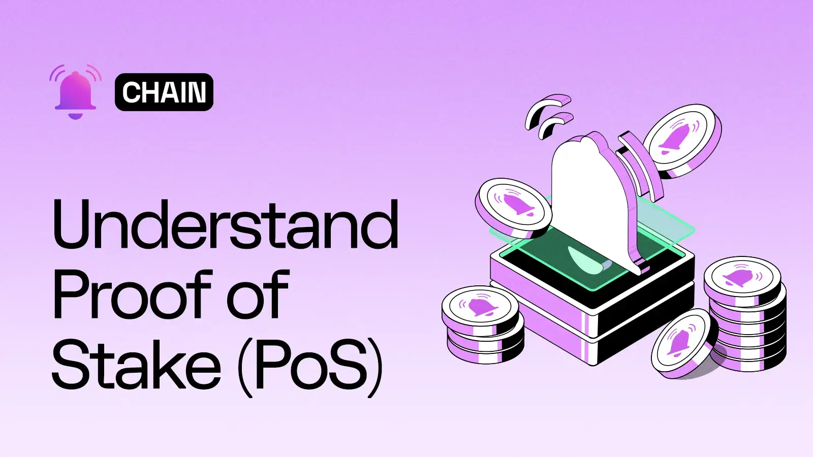
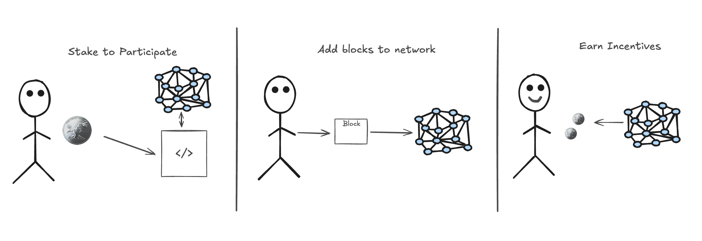
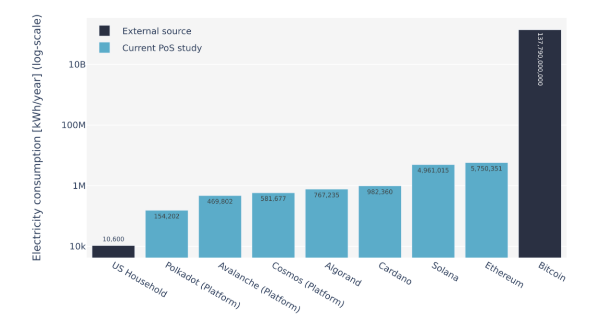
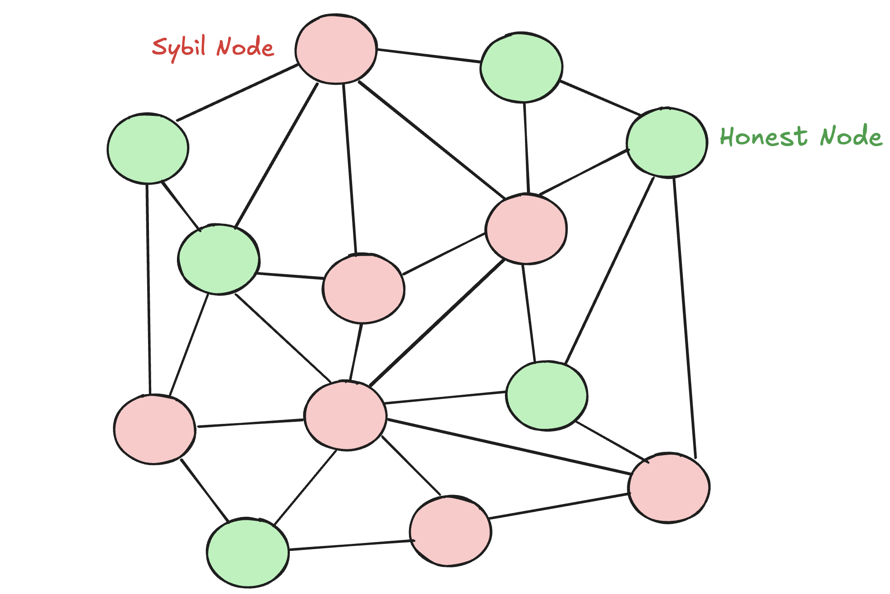
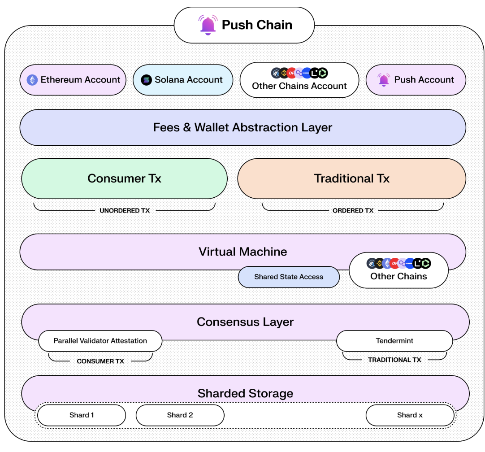

<!--truncate-->

In a globally distributed computing environment, achieving collective agreement on the true state of the system has always been a complex challenge.

Fortunately, there are algorithms ( *specialized instructions* ) that assist in preserving this ‘single-truth-state’ while balancing network security, long-term sustainability, and economic incentives.

Such algorithms in the web3 space, are popularly known as - Consensus Algorithms.

This article is the only guide you will need to know about - What Proof oF Stake is, Its significance and how does it work.

## Proof Of Stake - A quick overview:

Proof Of Stake is a consensus algorithm used to secure blockchain networks where block producers (validators) are chosen based on the number of tokens they're willing to "stake" or lock up as collateral. 

Validators are incentivised to act honestly, since, any malicious behaviour would result in them losing their staked assets.

[DIAGRAM]

Validators - Are Nodes responsible for securing the network by performing two key actions:

- Proposing new blocks - containing transactions.
- Attestation - Examining and voting on the blocks proposed by other validators

Now that we have a basic understanding about the PoS.

**Lets go down the rabbit hole to know more about it.**

## Why do we need PoS?

Each network is  based on some foundational philosophies.

Bitcoin  popularly known for its PoW (Proof of Work) algorithm is based on the principal of -**Earning the right to validate by demonstrating computational work.** 

Where as chains like Ethereum, Solana and Push Chain - are predominantly based on the philosophies of “**Proving value to validate and earn incentives  at the risk of commitment and economic loss”**

This proves your commitment towards the network by staking tokens to participate in network’s consensus with the risk of being penalized for jeopardizing the network’s security.

### Ease of Entry:

Staking makes it easier for individuals to participate in securing the network, promoting decentralization.

An Ethereum validator node could be easily run on a normal laptop.

### Energy Efficiency:

→ PoS networks are highly energy efficient in terms of cost of operations and compute consumption.

→ PoS eliminates the energy-intensive mining computations of PoW, replacing them with a stake-based validator selection process that requires only basic network communication and transaction validation operations.

### Stake to participate:

In PoS networks, **influence is tied to economical commitment instead of computational power.**

Participants (validators) pledge their assets (stake) in exchange for the right to participate in the network’s consensus.

Thus, creating an relationship that  equally benefit the interests of the validators as well as the collective network.

*The equation only stands true until the validators stay true to their commitments.*

### Skin in the game:

The success of a PoS network hinges on the honesty of its validators.

Validators are required to deposit (stake) the networks native currency in adequate quantities to participate  in the block creation.

Validators risk losing their staked assets *(getting slashed* *)i*f they attempt to game the system for their personal gains by :

- Approving fraudulent transactions
- Censoring incoming transactions.
- Failiing to participate
- Sending conflicting attestations
- Proposing multiple blocks in a single slot (aka Equivocating)

As the network grows, the cost to attack it increases proportionally.

The amount of tokens slashed varies with every network.

To know about slashing values for Push Chain - visit the Push Chain Governance Proposal [PROPOSAL LINK].

### Scalability:

In PoS the block creation is a process of “**probabilistic election**” rather than “**computation competition**”.

Since time taken to elect a validator is significantly less, block creation frequency is (arguably) much higher than PoW networks, significantly boosting transaction speeds and scalability.

### Security and Resilience:

As highlighted earlier, in a PoS network, the cost to attack increases proportionally with the network’s growth.

A 51% attack—where malicious actors gain control of 51% of staked coins to reverse transactions and manipulate block confirmations—becomes increasingly impractical and expensive as the network grows and the token prices rises (ideally).

Dominic Williams, Founder of ICP, outlines three critical elements of Sybil resistance in his paper

‘[Sybil-resistant Network Identities From Dedicated Hardware](https://docs.google.com/document/d/1eRTAe3szuIoZEloHvRMtZlrU7t2un4UVQ8LarpU3LNk/edit?tab=t.0)’

- **Entry Cost:** The expense required to participate.
- **Existence Cost**: Ongoing costs to maintain participation.
- **Exit Penalty**: The penalties for leaving or misbehaving

PoW chains like Bitcoin does not have an Exit Penalty mechanism - to punish the validators for deterring the integrity of network. But PoS chains, like Push Chain - cover all the bases, ensuring stricter sybil resistance.

## How does Proof of Stake work?

The Proof of Stake (PoS) process operates in three key phases:

1. **Validator Selection**
2. **Block creation and validation**
3. **Finalization**

### **Validator Selection:**

Validator selection forms the backbone of PoS, where nodes participate by staking the network’s native currency into a deposit contract. The staked amount must meet or exceed a predetermined threshold or lowerbound (e.g., 32 ETH for Ethereum).

To propose a block, the probability of validators getting elected is directly proportional to the staked amount relative to the total coins staked across the network.

### **Block creation:**

Timekeeping is critical in PoS, structured through two key units: **Slot** and **Epoch.**

- A slot - is a fixed duration of time that varies network to network ( 1 slot = 12 sec in Ethereum and 400ms in Solana).
- **Epoch**: A cycle comprising multiple slots (e.g., 32 slots in Ethereum)

Slots are sequential and occur one after other in a linear manner.

(*But not in case of Push Chain - More on this later)*

Each slot is assigned to a randomly chosen validator, selected through  Specialized algorithms like RandDAO in Ethereum and VDF - Verifiable Delay Function in Solana.

Within their slot duration, validators responsible for tasks:

- Package transactions into a block
- Verify their validity
- Initiate the process of propagating the block across the network.

### **Validation and Finalization**

Once a block is proposed, a committee of a defined number of validators is randomly chosen to vote on the validity of the block by careful examining of its contents - This process is called as attestation.

**Attestation Weight**: Each vote is weighted based on the validator’s stake.

**Confirmation**: A block is finalized when at least 2/3 of the total staked tokens sign off on its validity, ensuring a strong consensus.

### Edge cases:

- **Missed Blocks -**
    - Instances when a validator fails to propose a block within their slot, it results in a missed block.
- **Orphaned Blocks -**
    
    These occur when a block is rejected by the validating committee or during a chain fork.
    
    Orphaned blocks represent alternative versions of chain historythat are not followed  by majority of network.
    

In summary, this is how the entire process would look like:

### How does Push Nodes use PoS?

Push Chain - is a Proof of Stake shared state blockchain for shared app experiences designed to support the development of **hyper-scalable, consumer-centric, universal web3 applications.**

Push Chain enables txs from any chain (Solana, Eth, EVM, or non-EVM) with fast finality of < 1 second and the ability to scale infinitely as nodes increase, supporting tens of thousands of parallel transactions

- Any Chain Tx ⛓️
- Fee & Wallet Abstraction 💰 🔐
- Parallel Validation and Dynamic Sharding 🛠️
- Consumer tx (unordered) and Traditional tx (ordered)
- Universal Smart Contract 🌐
- Shared App Experience  🤝

Push Chain uses an innovative approach towards tweaking its consensus mechanism in order to incorporate its multi-node architecture and ability to support both, ordered and un-ordered blocks with parallel validation.

Push Chain distributes responsibilities across three specialized node types:

**Validator Nodes -**  Forms the backbone of the network, handling transaction validation and block production. 

**Storage Nodes** - Manage the network's data through dynamic sharding, enabling efficient  distribution and retrieval. Storage Nodes work in sync with validators to ensure data availability and decentralization.

**Archival Nodes** - Serve as the network's historical record keepers, storing complete transaction logs and providing WebSocket functionality for real-time data access and analytics.

Optimised for hyper scalable consumer apps - Push Chain introduces **stateless blocks** with parallel execution ****for faster processing and validation of non-value consumer data transactions.

For selecting block validators - the system uses a multi-level randomization process to avoid  validator collusion during parallel block processing.

More details about the randomization mechanism can be found in the Push Chain Whitepaper.

To maintain the network’s economical integrity - Push Chain has a modified penalising mechanism which  includes the act of ‘Reporting’ - Which acts like a warning to correct the node’s behaviour instead of simply slashing and banning the node instantly.

There are a lot more novel and interesting elements that make Push Chain a powerful choice for building Universal Apps - Read [Push Whitepaper] to know more!
